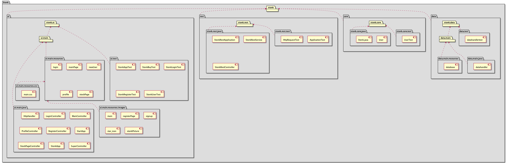

[](https://gitpod.stud.ntnu.no/#https://gitlab.stud.idi.ntnu.no/it1901/groups-2021/gr2135/gr2135)


# STONK APP

**Stonk** is a stock ["Paper Trading"](https://www.investopedia.com/terms/p/papertrade.asp) application, where the stock prices get updated in real time. Trading with virtual money is a great way for beginners to learn how to trade in the financial markets, but also to experienced traders that want to test their trading strategies without any risk.

Our initial thought was to pull the stock prices using an API, but we decided against it as we needed a service that was free-of-charge. Therefore we get the stocks current price by web-scraping from marketwatch.com. We use .json files for saving information such as username, password and your balance. The reasoning behind this is that more advanced systems is not needed for a game like Stonk.

## How to use Stonk:

> ### Run Stonk locally:

> 1. Clone (https://gitlab.stud.idi.ntnu.no/it1901/groups-2021/gr2135/gr2135/-/tree/master)
> 2. Open the folder in a IDE as a Maven project.
> 3. Navigate into the Stonk-directory via the commandline. Example: `cd Stonk`.
> 4. Run `mvn clean install -DskipTests` via the command-line inside the project folder.
> 5. Run the spring-boot server.(Process described right below)
> 6. To start the app navigate into the ui package (Stonk/ui) and run: `mvn javafx:run`.


> ### Run Stonk-Server:

> Steps to run server:
>
> 1. Make sure the project is clean, you can make sure of that by using the `mvn clean install -DskipTests` command in the command-line from the "Stonk" directory
> 2. Navigate yourself into the "rest" directory with the "cd" command. Example: `cd Stonk/rest`
> 3. Type `mvn spring-boot:run` into the commandline and your server will be generated. The backend of the app is now functional!


> ### Run Stonk in Gitpod:

> The repository also includes Gitpod configuration files. Follow theese steps to run the app.

> 1. Enter GitPod via the first link in this readme, or [here](https://gitpod.stud.ntnu.no/#https://gitlab.stud.idi.ntnu.no/it1901/groups-2021/gr2135/gr2135)
> 3. Navigate into the "Stonk" directory via the commandline. Example `cd Stonk`.
> 4. Initialize the project with the "mvn clean install -DskipTests" -command.
>5. When the build is done, start the server by navigating into the rest-directory and running `mvn spring-boot:run`.
>6. When the server is running, navigate into the ui-directory and run: `mvn javafx:run`

> ### Additional Commands

> - To run various tests:
>    - To run the tests, use the command "mvn clean install"
         - The tests can be run seperately in each module, or in the entire project via their respective directories (Stonk, ui, rest, core, integration, data)
>        - If the project is cleaned already, use "mvn test" or "mvn verify"
> - For a report by jacoco, use `mvn jacoco:report` in any given module.
>    - Example: `cd Stonk/core` followed by `mvn jacoco:report`
>    - The report will then be generated inside "target/site/index.html" in the given module.


## Package diagram


## Functionalities: 
- Log in
- Register
- Search up stocks
- Buy stocks
- Sell stocks
- Add stocks to wishlist
- Add more money
- Log out
- Delete user

## Project file
You can find more information about the code in the project file. It is divided into four parts. Core, data, UI and rest.

### CORE:
Core contains the central logic of the app and is where we have our two main java classes Stonk.java and User.java. It is completely independent of the UI.

- User.java is where the user credentials are made.
- Stonk.java is the class that gets the information about the stock you want to look for by web scraping the web page matketwatch.
- This is where you can find theese files.
[Core](https://gitlab.stud.idi.ntnu.no/it1901/groups-2021/gr2135/gr2135/-/tree/master/Stonk/core/src/main/java/core)

## Data
Data is the package for storing and handling data. Datahandler.java both reads and writes to the local file "Database.json"
- You can find it here:
[Data](https://gitlab.stud.idi.ntnu.no/it1901/groups-2021/gr2135/gr2135/-/tree/master/Stonk/data/src/main/java/data)

### UI
UI is the package for where the user interface is made. Here the two main components are the fxml and Controller classes. The FXML files are where the actual user interface is made with scene buidler. THe controller classes it where the connection between the frontend and backend is. Here for instance the buttons from the fxml get their functions that tell them what to do.
- You can find the fxml files here:
[UI FXML](https://gitlab.stud.idi.ntnu.no/it1901/groups-2021/gr2135/gr2135/-/tree/master/Stonk/ui/src/main/resources/ui/fxml)
- You can find the Controller classes here:
[UI Controller](https://gitlab.stud.idi.ntnu.no/it1901/groups-2021/gr2135/gr2135/-/tree/master/Stonk/ui/src/main/java/ui)

### REST
The Stonk-server is generated with the Spring-Boot framerwork and stored as a JSON-format on your local network. This is where the state of your user is saved 
continuously throughout the use of the application. The server is made up of three java-classes:
- StonkRestApplication.java - The class which "fires up" the server.
- StonkRestController.java - Receives all the requests that server receives, and returns information to the sender via "StonkRestService"
- StonkRestService.java - Is the logic, or the "backend" of the server. It receives parameters from the controller and then validates and executes the given command. And then returns feedback to the user. The server is run on localhost:8080

- The rest-classes can be located here: 
[Rest](https://gitlab.stud.idi.ntnu.no/it1901/groups-2021/gr2135/gr2135/-/tree/master/Stonk/rest/src/main/java/rest)


## Project architecture


### Structure of the app:

<details>

<summary> 

#### Full Structure (click on the arrow)
</summary>

```
 .
└── gr2135/
    ├── .idea/
    │   ├── gr2135.iml
    │   ├── misc.xml
    │   ├── modules.xml
    │   ├── runConfigurations.xml
    │   └── vcs.xml
    ├── .vscode/
    │   └── settings.json
    └── Stonk/
        ├── core/
        │   ├── src/
        │   │   ├── main/java/core/
        │   │   │   ├── Stonk.java
        │   │   │   └── User.java
        │   │   └── test/java/core/
        │   │       ├── StonkTest.java
        │   │       └── UserTest.java
        │   └── pom.xml
        ├── data/
        │   ├── src/
        │   │   ├── main/java/data/
        │   │   │   └── DataHandler.java
        │   │   └── test/java/data/
        │   │       └── DataHandlerTest.java
        │   └── pom.xml
        ├── rest/
        │   ├── .mvn/wrapper/
        │   │   ├── MavenWrapperDownloader.java
        │   │   ├── maven-wrapper.jar
        │   │   └── maven-wrapper.properties
        │   ├── src/
        │   │   ├── main/
        │   │   │   ├── java/rest/
        │   │   │   │   ├── StonkRestApplication.java
        │   │   │   │   ├── StonkRestcontroller.java
        │   │   │   │   └── StonkRestService.java
        │   │   │   └── resources/
        │   │   │       └── application.properties
        │   │   └── test/java/Stonk/rest/
        │   │       └── ApplicationTest.java
        │   ├── mvnw
        │   ├── mvnw.cmd
        │   └── pom.xml
        ├── ui/
        │   ├── src/
        │   │   ├── main/
        │   │   │   ├── java/ui/
        │   │   │   │   ├── HttpHandler.java
        │   │   │   │   ├── LoginController.java
        │   │   │   │   ├── MainController.java
        │   │   │   │   ├── ProfileController.java
        │   │   │   │   ├── RegisterController.java
        │   │   │   │   ├── StartApp.java
        │   │   │   │   ├── StockPageController.java
        │   │   │   │   └── StonkApp.java
        │   │   │   └── resources/ui/
        │   │   │       ├── fxml/
        │   │   │       │   ├── login.fxml
        │   │   │       │   ├── mainPage.fxml
        │   │   │       │   ├── newUser.fxml
        │   │   │       │   ├── profile.fxml
        │   │   │       │   └── stockPage.fxml
        │   │   │       └── images/
        │   │   │           ├── main.png
        │   │   │           ├── registerPage.png
        │   │   │           ├── signup.png
        │   │   │           ├── star-icon.png
        │   │   │           ├── stockPage.png
        │   │   │           └── stonkpicture.png
        │   │   └── test/java/ui/
        │   │       ├── README.md
        │   │       ├── StonkAppTest.java
        │   │       ├── StonkBuyTest.java
        │   │       ├── StonkLoginTest.java
        │   │       ├── StonkRegisterTest.java
        │   │       └── StonkUserTest.java
        │   └── pom.xml
    ├── README.md
    └── pom.xml
```
</details>

### Tree Structure visualized:




