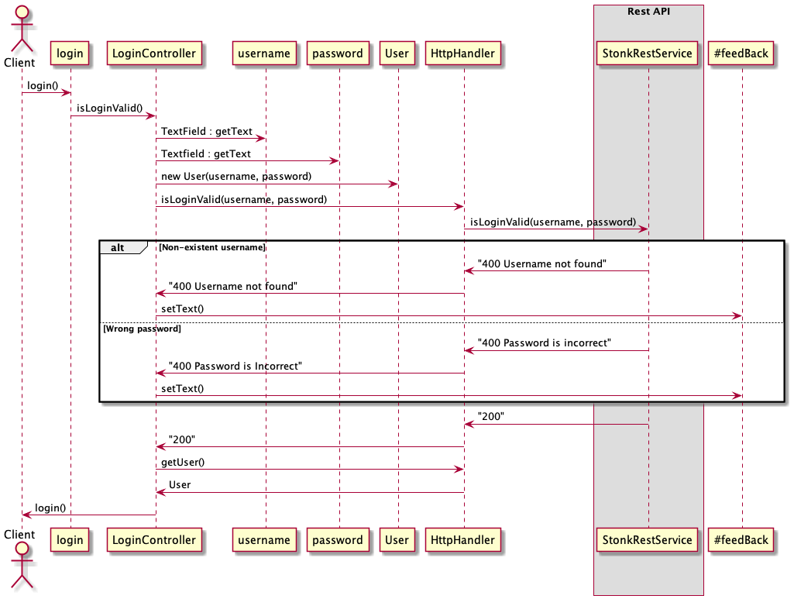
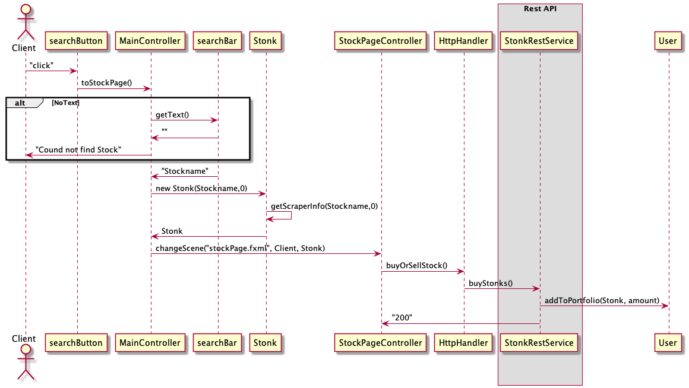

# Stonk code Strucutre!

In this section we will write about how the code is built, everything from which libraries we are using to illustrations and the functioning of the different files.

## Maven build
Maven is a software project management and building tool. Based on the concept of a project object model (POM). The Maven-build for our app needs at least Java version 14, and JavaFX version 11.

The reason we went with maven instead of gradle is because it uses an XML file for declaring the project, its dependencies, the build order, and its required plugin. This is something we find familiar and easy to understand from doing former projects.

### The "Shippable" Application
The shippable product of our application comes in the form of a .jar file that is produced in the target-folder. Unfortunately it has to be run from the command-line, which is explained in the section below. The reason of this is we didnt manage to produce a workaround that Jlink didnt allow JSOUP(Our webscraper), to be in the jar-file.

#### How to produce and run shippable application
1. Make sure the project is clean with the `mvn clean install -DskipTests` command
2. Navigate into the ui-directory and run `mvn assembly:single`
3. The .jar-file will then appear in the target-folder.
4. To run the .jar use `java -jar FILEPATH/ui-0.0.1-SNAPSHOT-jar-with-dependencies.jar`

### JSoup
**Stonk** is built with the library [JSoup](https://jsoup.org). Jsoup allows us to scrape and parse data from a website using DOM traversal and CSS selectors. 
Using this we are able to get information about every given stock in real-time.
### Gson 
Gson is a great Java library that primary use is to convert Java Objects into their JSON representation. It also gets used to convert a JSON string to an equivalent Java object. 
### JAVAFX
JavaFX is a Java library that simplifies the development of Rich Internet Applications (RIA). Applications written using this library can be run across different platforms. The applications can also be run on various devices such as computers, mobile phones, TVs and tablets.
### Spring Boot
Spring Boot is an open source, micro-service-based Java network. The Spring Boot framework creates a completely production-ready environment that is fully configurable using the pre-built code in the code base. The Microservice architecture provides developers with a full-featured application, including embedded application servers.

### SpotBugs, CheckStyle and JaCoCo
- Spotbugs has helped with finding unused codes and errors or bugs we were not able to find ourselves. 

- Checkstyle made the code quality much better by helping standardizing our formatting to Google coding conventions

- We use jacoco which is a Code Coverage Library, to check how much coverage our tests have. Our goal is to have at least 80% test coverage at each of our modules.

## How we have Coded
### Meetings
The miniumum requirments we set for ourselves was to meet once a week, but we found it better to meet around 3 times a week to more easily pair code(parr-programmering) and communicate better. We also focused on following the coding commit rules given from [conventionalCommits](https://www.conventionalcommits.org/en/v1.0.0/) 

### Pair coding
Pair programming has helped us to higher the quality of the code by prrogramming out loud with a driver and navigator working together. We started meeting more often to pair program as much as possible.

### Checking each others code
we set ourself a goal that evereyone in the group should know how all the libraries we use, actually work. That is why we met at school at least 3 times for pair program but also for evaluating each others code. We also made it mandatory to never merge someones code without reading it and if you found it necesaary to also add a comment in the merge request. 

### SCRUM
SCRUM has been central for our coding. We have participated and are aware of all sorts of agile ceremonies (user story grooming, sprint planning, sprint retrospective). This helped to impact the end product, by having fixed deliveries in short iterations with a fixed length in close, ongoing collaboration between customer and supplier. Apart from the Sprints, the QA (who does it, when it gets done) helped alot. Being able to asign and set a deadline on gitlabs really helped having control over our project. 

SCRUM was a powerful tool that empowered us to fix our mistakes quickly and made the whole team feel acountabel for the delivery, and in addition it is really easy not to get stuck on problems because if you do, you can simply ask the team in the next meeting.

#### How gitlab helped
Gitlab is great for enabling lean and agile project management especially for scrum projects. Here we were able to add issues, which had a deadline, labels and could be issued to grup members. THe milestone and board functionalities also helped us hold upå with deadlines.

## Files

CORE:
  - Stonk.java: Pulls information about the stock using JSoup.
  - User.java: Creation and editing of user information.
  

DATA:
   - database.json: Saves information like username, password and balance.
   - Datahandler.java: Saving data to the json file.

UI:
- LoginController.java: Controller for login page
- MainController.java: Controller for main page where you se your cash balance and stocks
- ProfileController.java: Controller for profile page where you can edit your account
- RegisterController.java: Controller for register page to make a new account
- StockPageController.java: Controller for Stock page
- StonkApp.java: Connects the fxml files to the project.
- HTTPHandler.java: Sends requests up to our server. 
- SuperController.java: a Controller sites thath loads all the fxml files.

REST:
- StonkRestApplication.java: Launches our rest-api.
- StonkRestController.java: The controller for our api with the different paths on the application.
- StonkRestService.java: The "backend" for our server which can execute most of the functionality in our app.

# User Story 1
*Connected to issue [#9](https://gitlab.stud.idi.ntnu.no/it1901/groups-2021/gr2135/gr2135/-/issues/9).*

"As a stock broker I want to have a list over the stocks I own virtually, so that I can easily compare my virtual stocks to my actual stock holdings."

# User Story 2
*Connected to issue [#24](https://gitlab.stud.idi.ntnu.no/it1901/groups-2021/gr2135/gr2135/-/issues/24).*
 

"As a user, if the app doesn't respond, I would like som feedback boxes so that it would be easier to understand why the app is not working at a given time.

# User Story 3
*Connected to issue [#40](https://gitlab.stud.idi.ntnu.no/it1901/groups-2021/gr2135/gr2135/-/issues/40).*
 

"As a user, privacy is important to me, so I would like some kind of mechanism to store our data more secure."

# User Story 4
*Connected to issue [#41](https://gitlab.stud.idi.ntnu.no/it1901/groups-2021/gr2135/gr2135/-/issues/41).*
 

"As a user who watches some stocks more closely than others, I would like a watchlist so that I could easily be updated on all of them."

## Illustrations

   Profile side where you can add more money to you account
 

   Stockpage to buy, sell and add stocks to watch List

  Homepage showing balance and stocks you own

  Login site

  Register a new user site

## Diagrams

### sequence diagram:

#### Diagram for logging in

#### Diagram for buying a single stock

